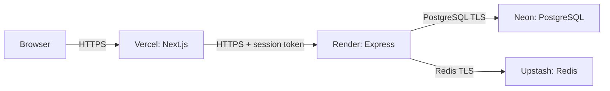

# Phase 17: free deployment setup

## Current checkpoint

This phase prepares a free portfolio deployment. The repository now contains the API Docker image, a Render Blueprint, a deployment environment template, a repeatable Linux container test, and a read-only deployment check. The live deployment is pending your provider accounts, secret configuration, and your review/commit of these files. No cloud service has been created, no payment plan enabled, and no code committed for you.

Use **Vercel Hobby** for Next.js, **Render Free** for the Express API, **Neon Free** for PostgreSQL, and **Upstash Redis Free** for the queue and rate limits. Keep all four on their free plans. Use the supplied `vercel.app` and `onrender.com` domains so a purchased domain is unnecessary.

This is a portfolio demo with usage limits and cold starts. Render documents that a free API sleeps after 15 idle minutes and typically takes about a minute to wake. Our website's five-second API deadline remains bounded: the first visit may show an error; wait roughly a minute and retry. Opening the API's `/ready` URL before an interview can wake the demo. No scheduled keep-alive workaround is included.

## Why four services?

The Next.js server handles forms and the HttpOnly session cookie. It calls the Express API over HTTPS. The API keeps durable accounts/tickets in PostgreSQL and coordinates admission in Redis. The API's existing release worker runs inside the API process; a sleeping service resumes pending release jobs when it starts again.



Only `FAIRGATE_API_URL` belongs in Vercel. PostgreSQL and Redis passwords stay in the API's secret settings. Session tokens remain server-only. The browser posts to its own Next.js origin, so adding permissive cross-origin headers to the API is unnecessary.

## Changed files and what to read

| File | Purpose |
| --- | --- |
| `apps/api/Dockerfile` | Linux build; separate one-off administration image; non-root runtime with production dependencies. |
| `.dockerignore` | Allow only API build inputs and workspace manifests. Exclude local secrets, generated Windows files, Git history, and reports. |
| `render.yaml` | One Free Docker API, `/ready` health checks, secret prompts, and manual deployments. No paid datastore or disk. |
| `apps/api/prisma.config.ts` | Use optional `DIRECT_DATABASE_URL` for migrations; retain `DATABASE_URL` fallback locally. |
| `deploy/.env.example` | Placeholder settings for remote TLS connections; no real credentials. |
| `scripts/test-deployment.mjs` | Build/run the image with disposable PostgreSQL and Redis; verify real API behavior and Linux shutdown. |
| `scripts/check-deployment.mjs` | Read-only readiness, catalogue, webpage, sign-in form, and poster checks against supplied origins. |
| `package.json` | `test:deployment` and `deploy:check` commands. |

No new runtime library was added. Vercel handles the web app natively, so this plan does not require a web Docker image or a static export. Server Actions need a server runtime.

## 1. Review the phase locally

With Docker Desktop running, from the repository root:

```sh
npm run typecheck
npm run test:deployment
```

The deployment test builds `fairgate-api:verify` and `fairgate-api-tools:verify`. It creates containers and a network with a unique `fairgate-verify-...` name. PostgreSQL uses temporary memory-backed storage; no existing named volume or host `DATABASE_URL` is used. The test checks native password hashing, configurable `PORT`, group booking/rollback, queue handoff, persistence across an API restart, and a clean SIGTERM shutdown. It removes its own containers/network afterward and retains build images/cache for faster reruns.

Read the code, then commit and push it yourself when clear. Render and Vercel import the repository through your own GitHub authorization. Their deployed version must contain this phase's files.

## 2. Create the free data services

### Neon

Create a Free project and database, preferably PostgreSQL 17 to match local development. Choose a region near the API; Render's Blueprint defaults to Oregon unless you add a different supported region before creating it. Copy both the pooled application connection and the direct connection from the Connect dialog. Ensure both point to the same project, branch, and database.

Use the pooled connection for `DATABASE_URL`, and the direct one for `DIRECT_DATABASE_URL` in your local deployment tools file. Preserve certificate verification; the example uses `sslmode=verify-full`. Do not set `rejectUnauthorized: false` or disable TLS checks. The API still uses the existing `pg` adapter; no Neon-specific SDK or account system is needed.

### Upstash

Create a **Free Redis database**, not a paid trial/upgrade. Choose a nearby primary region. Copy its native Redis connection URL, which begins with `rediss://`; the HTTPS REST endpoint and REST token are not compatible with our existing `redis` TCP client. Keep eviction disabled: queue and rate-limit keys must expire by their defined deadlines, not be evicted under memory pressure. Use a dedicated database for FairGate, not a cache shared with another app or preview environment.

The existing Lua scripts remain the source of queue ordering. Provider documentation lists native TCP and scripting support; live queue admission and deadline behavior must still be exercised after connecting this actual database. Do not substitute local in-memory admission if a hosted command fails.

## 3. Prepare the new database once

Copy the template once, keeping any existing deployment secrets file:

```powershell
if (-not (Test-Path -LiteralPath .env.deploy)) { Copy-Item deploy/.env.example .env.deploy }
```

Fill `.env.deploy` locally with the new service values. It is ignored by Git and excluded from the Docker context. Put credentials here or in provider secret settings, not in source files or chat. Never replace `apps/api/.env`, which belongs to your existing local database.

Build the separate tools image, then run the release steps:

```sh
docker build -f apps/api/Dockerfile --target tools -t fairgate-api-tools:deploy .
docker run --rm --env-file .env.deploy fairgate-api-tools:deploy npm run db:deploy
docker run --rm --env-file .env.deploy fairgate-api-tools:deploy npm run db:seed
```

These commands **write to the database specified by `.env.deploy`**. Verify that it is the intended new FairGate deployment database before running them. Migrate once before serving the matching release; seed explicitly for the initial demo. The seed inserts missing movies and seats without importing local users or tickets. Both migrations and the seed prefer `DIRECT_DATABASE_URL`, falling back to `DATABASE_URL` for local development. The running API continues to use `DATABASE_URL`.

Render's free service does not provide the paid pre-deploy-command feature. This is why migrations are an explicit one-off step instead of being hidden in the image's startup command. Never run reset or development migrations against the deployed database.

### If the seed reports P2028

Successful migrations confirm that the migration connection works, but do not prove that the application's pooled connection works. The original seed shared the API's three-second connection deadline and Prisma's default two-second transaction-start limit. A slow initial connection could exhaust that deadline; the error alone does not establish a provider outage or missing migration.

The seed now has its own one-connection client. It uses the same direct URL as migrations, runs `SELECT 1` before starting the transaction, allows 15 seconds to connect, 20 seconds to acquire the transaction, and 60 seconds for the transaction to finish. Individual statements still have a 15-second limit. The API's request deadlines stay unchanged. Inserts remain one atomic transaction; reruns preserve existing rows and bookings.

After changing the seed code, **rebuild the tools image**; running an old image keeps the old code:

```sh
docker build -f apps/api/Dockerfile --target tools -t fairgate-api-tools:deploy .
docker run --rm --env-file .env.deploy fairgate-api-tools:deploy npm run db:seed
```

No reset or repeated schema migration is required when `db:deploy` already reports no pending migrations. If the new seed still fails, inspect the error and check the direct connection settings and database availability instead of repeatedly increasing deadlines. Keep credentials out of chat.

Learning check: explain how the connection deadline, transaction-start deadline (`maxWait`), and transaction execution deadline (`timeout`) differ. Why can a one-off seed wait longer than an HTTP booking request?

## 4. Deploy the API on Render

Import the repository as a **Blueprint** using `render.yaml`. Review that it contains just one **Free** web service. Enter `DATABASE_URL` and `REDIS_URL` when prompted. Do not add a paid PostgreSQL service, disk, or worker. Render supplies `PORT`; the image listens on it and on `0.0.0.0`.

The Blueprint uses the repository root as its build context and `apps/api/Dockerfile` as its Dockerfile. Its health check is `/ready`, which requires PostgreSQL and Redis. The runtime is the Dockerfile's final `runtime` stage, not `tools`. Startup runs Node directly so Render's SIGTERM reaches the API and the release worker can stop cleanly.

When deployment finishes, note its public `https://...onrender.com` URL. Open `/ready`; a healthy response has `status: ready`. If readiness fails, check the service logs and secret values. Do not replace it with an always-successful check to conceal a dependency failure.

Automatic deployments are off in the Blueprint so a Git push cannot apply application changes before you have prepared the corresponding database release. Manually deploy after migrations and review. For later breaking schema changes, arrange a maintenance window by suspending the service before migration, then deploy/resume the matching image. Rolling back code alone does not undo database changes; avoid destructive down migrations.

## 5. Deploy the website on Vercel

Import the same repository into a **Hobby** project. Use these settings:

| Setting | Value |
| --- | --- |
| Framework | Next.js |
| Root Directory | `apps/web` |
| Node.js version | 22.x |
| Build / install | Keep Vercel's detected Next.js/npm workspace defaults. |
| Source outside root | Include files outside the root directory so the root workspace lockfile is available. |
| Production environment variable | `FAIRGATE_API_URL=https://YOUR-API.onrender.com` |

Do not set `FAIRGATE_ALLOW_HTTP_API`: the cross-provider API connection uses public HTTPS. Do not prefix the API setting with `NEXT_PUBLIC_`, and do not give Vercel database/Redis credentials. Deploy after the API is ready. Use the generated HTTPS Vercel URL; a local HTTP check is not equivalent to browser Secure-cookie verification.

Review Vercel's connected-Git deployment behavior: later production-branch pushes can deploy the website automatically. Coordinate those releases with the API/schema. Keep preview deployments from writing to the live demo database by leaving the API variable unset for Preview until a separate preview backend is intentionally configured. Do not loosen Server Action origin checks to fix a misconfigured URL.

## 6. Verify the public deployment

Run the read-only check with the actual URLs:

```sh
npm run deploy:check -- --api https://YOUR-API.onrender.com --web https://YOUR-WEBSITE.vercel.app
```

The script makes one bounded readiness attempt lasting at most 90 seconds, including retries for a cold start. It does not create accounts or mutate queue/booking state. It follows no redirects and rejects credential-bearing URLs and plain public HTTP. `--local` permits HTTP only on loopback for local testing.

Then review in your browser:

1. Open the public HTTPS website and inspect the movie posters at desktop and phone widths.
2. Click Book tickets while signed out, register a demo account, and confirm automatic continuation.
3. Verify the session cookie has Secure and HttpOnly and is sent successfully over HTTPS; no token should appear in the page or client JavaScript.
4. Use three different accounts/profiles for the same show: two admitted, one waiting. Confirm a group; check all seats and one total/reference, no remaining timer on confirmation, and promotion of the waiter.
5. Try overlapping group selections and a repeated submission. Check that no partial group or duplicate ticket is created.
6. Restart/redeploy the API. Confirm the ticket remains in My bookings and Redis admission remains shared. If the API sleeps long enough, checkout turns and waiting leases naturally expire; customers get a new turn rather than restored expired admission.
7. Check the last-30-second warning, expiry, keyboard focus/seat selection, mobile overflow, and the Leave control.

The demo seed has fixed showtimes on 10 October 2026. Later, add new show IDs with future dates; do not rewrite the history of booked screenings. This phase does not create an ongoing schedule updater.

## Free-plan limits and sources

Checked 15 September 2026. These are provider limits, not measured FairGate throughput:

- [Vercel Hobby](https://vercel.com/docs/plans/hobby) is for personal, non-commercial use; suitable for this no-payment portfolio demo. [Monorepo setup](https://vercel.com/docs/monorepos) explains the application root setting.
- [Render Free](https://render.com/docs/free) has sleep/cold-start behavior and monthly limits. Its free PostgreSQL expires after 30 days, so the plan uses Neon. Without a payment method, exceeding applicable included usage can suspend service rather than create a paid upgrade. [Blueprint settings](https://render.com/docs/blueprint-spec) and [deploy steps](https://render.com/docs/deploys) document Docker, health checks, manual deployments, and the paid pre-deploy restriction.
- [Neon Free](https://neon.com/pricing) lists 0.5 GB storage and 100 CU-hours per project/month. The API's health checks and outbox polling query PostgreSQL while it is running, so do not assume the database will scale to zero during that time.
- [Upstash Free](https://upstash.com/pricing/redis) lists 256 MB and 500,000 commands/month. Polling and Lua work consume quota; use the local traffic simulator for load experiments. [Compatibility](https://upstash.com/docs/redis/overall/compatibility) documents the native Redis protocol and supported features.

Keep the free plans selected, avoid adding payment methods or enabling automatic paid upgrades, and check usage before sharing a high-traffic link. This plan makes no always-on, production-capacity, or bot-proof claim.

## Verification at this checkpoint

- Workspace type checks passed.
- The real Linux container test passed: migrations/seed, non-root runtime, native password hashing, a runtime-selected port, atomic group conflict handling, queue handoff, the same booking returned after an API restart, and clean SIGTERM shutdown. Its disposable containers and network were removed.
- The read-only deployment checker passed against the compiled API and production Next.js locally: readiness, nonempty catalogue, homepage, sign-in form, and three poster assets.
- Public provider connectivity, TLS, and browser Secure-cookie/group-booking checks remain pending deployment. Local loopback HTTP does not verify these.

The production dependency prune reported zero npm audit findings at this check and excludes Prisma CLI, tsx, and TypeScript. The build/administration dependencies still reported four high-severity findings in the existing Prisma tooling dependency tree (including deepmerge-ts and mysql2). They are excluded from the public runtime image; this is not a full container security scan. No forced dependency downgrade or unrelated upgrade was made in this deployment phase.

## Learning checkpoint

Trace one request from the browser, through Vercel and Render, to both databases. Explain why the API URL is safe to know but the session token/database passwords are secrets; why a build should not run migrations; and why a Docker container restart must not erase a ticket.

Small exercise: locate the runtime `PORT` setting and explain why `EXPOSE 4000` does not prevent Render from choosing another port. The container test deliberately runs the API on 8080. Run the test and find the successful restart/retry and clean shutdown assertions.

Stop here for your review and commit. Once your free provider accounts and settings are ready, continue Phase 17 with the actual deployment and HTTPS checks. Only after those pass should the README claim that FairGate is live.
